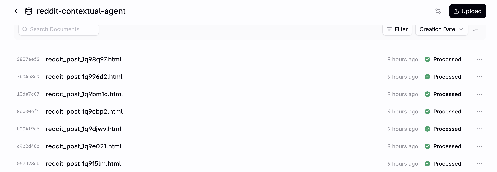

# Reddit Contextual Agent

A data pipeline that scrapes Reddit posts from RAG-focused subreddits and syncs them to [Contextual AI](https://contextual.ai) for building RAG-powered agents.

## Features

- **Scraping**: Fetches ALL posts within a time window
- **Supabase Backend**: PostgreSQL for state management and tracking
- **Update Cycle**: Posts tracked for 3 days with refresh, then frozen
- **Re-ingestion**: Only re-ingest when content changes (post edits, new comments, or comment edits)
- **Deletion Handling**: Automatically removes deleted/removed posts from datastore (Reddit Data API compliance)
- **Bot Filtering**: Excludes AutoModerator and known bots
- **GitHub Actions**: Daily automated scraping at 8 AM Pacific

## Architecture

```
┌─────────────────┐     ┌──────────────┐     ┌─────────────────────┐
│  Reddit API     │────▶│   Scraper    │────▶│  Supabase           │
│  (PRAW)         │     │              │     │  (PostgreSQL)       │
└─────────────────┘     └──────────────┘     └─────────────────────┘
                                                       │
                                                       ▼
                                              ┌─────────────────────┐
                                              │  Contextual AI      │
                                              │  (RAG Datastore)    │
                                              └─────────────────────┘
```

### Update Cycle

Posts go through a count-based lifecycle:
- **Day 0** (`update_count=-1`): Initial scrape and ingest
- **Day 1** (`update_count=0`): Skip (too early for meaningful changes)
- **Day 2** (`update_count=1`): Refresh - re-ingest if content changed (post edits, new comments, or comment edits), deleted posts automatically removed from datastore and database when detected
- **Day 3** (`update_count=2`): Freeze - no more updates

**Retention:** posts are stored in Supabase for up to 30 days (unless deleted/removed). 
**Freshness tracking:** posts are checked for updates for up to 3 days; after that, they are considered stable and no longer updated

## Setup

### Prerequisites

- Python 3.10+
- Reddit API credentials ([create app](https://reddit.com/prefs/apps))
- Contextual AI account ([contextual.ai](https://contextual.ai))
- Supabase account ([supabase.com](https://supabase.com))

### Installation

```bash
git clone https://github.com/akshan-main/reddit-contextual-agent.git
cd reddit-contextual-agent
python -m venv venv
source venv/bin/activate
pip install -e .
```

### Configuration

Copy `.env.example` to `.env` and fill in the api keys and supabase link

## Usage

### CLI

```bash
# Run full pipeline
python -m reddit_agent --mode full

# Scrape only (no updates)
python -m reddit_agent --mode scrape

# Update existing posts only
python -m reddit_agent --mode update

# With JSON logs (for CI)
python -m reddit_agent --mode full --json-logs
```

### Local Testing

Test the pipeline without actual Contextual AI ingestion:

```bash
python test_local.py
```

## GitHub Actions

The workflow runs daily at 8 AM Pacific time.

### Required Secrets

Add these to your repository settings:

| Secret | Description |
|--------|-------------|
| `REDDIT_CLIENT_ID` | Reddit app client ID |
| `REDDIT_CLIENT_SECRET` | Reddit app secret |
| `CONTEXTUAL_API_KEY` | Contextual AI API key |
| `CONTEXTUAL_DATASTORE_ID` | Target datastore ID |
| `SUPABASE_CONNECTION_STRING` | Pooler connection string |

### Manual Trigger

1. Go to **Actions** tab
2. Select **Reddit Scraper**
3. Click **Run workflow**
4. Choose mode: `full`, `scrape`, `update`, or `queue`

## Data Model

### What's Scraped

| Field | Description |
|-------|-------------|
| `id`, `subreddit`, `author`, `title`, `selftext` | Core post data |
| `score`, `num_comments`, `upvote_ratio` | Engagement metrics |
| `created_utc`, `edited` | Timestamps |
| `comments` (up to 100) | With author, body, score(proxy for upvotes - downvotes), depth |

### What's Ingested

Posts are converted to HTML documents with:
- Full post content with metadata
- All comments (sorted by score)
- Timezone (Pacific + UTC)

Metadata includes: `subreddit`, `author`, `title`, `score`, `upvote_ratio`, `num_comments`, `created_utc`, `created_pacific`, `date_pacific`, `post_id`, `is_self`, `external_url`, `flair`

### Sample Ingested Documents



## Project Structure

```
reddit-contextual-agent/
├── docs/
├── src/reddit_agent/        # All source modules
├── tests/
├── .github/workflows/
├── test_local.py            # Local testing
├── pyproject.toml
└── .env.example
```

# NOTE
The license in this repository applies to the code in this repository. Scraped Reddit content remains subject to Reddit’s terms and the original authors’ rights.